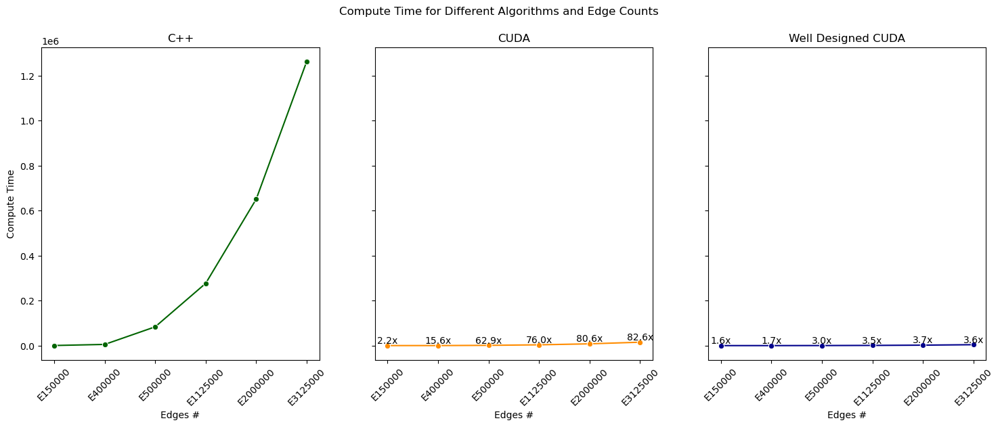

Cuda Based Robust SSP Problem
=============================

## Environments

### Local Workstation

1. System: WSL 2 Ubuntu 20.04.5 LTS
2. CPU: Intel Core i5-12600KF 10-Core Processor
3. GPU: NVIDIA RTX 3070 8GB RAM
4. RAM: 32GB
5. NVCC: V10.1.243
6. CC:  9.4.0
7. Driver: 531.41
8. CUDA: 12.1

### Server

1. System: Red Hat 8.5.0-10
2. CPU: AMD EPYC 7763 64-Core Processor
3. GPU: NVIDIA A40 48GB RAM
4. RAM: 256GB
5. NVCC: V11.6.112
6. CC:  8.5.09.4
7. Driver: 530.30.02
8. CUDA: 12.1

## Data Explanation

#### Data Instance

```
1000 # First Row: Number of Vertices
150000 # Second Row: Number of Edges

838 618 890 17.290661902827246 
981 611 944 10.019387690812502 
7 340 904 3.526561274367449 
367 323 762 3.3557391727453547 
```

* First Column: Departure Vertex;
* Second Column: Arrival Vertex;

Here, cost values of each edges follows a Normal Distribution $\mathcal{N}(\mu,\sigma)$,

* Third Column: $\mu$;
* Fourth Column: $\sigma$.

## Performance results

### Local Workstation VS Server


### Server



## Guide for users

All processes, including makefile, setup path, data processing, algorithm run result field storage, and visualization are integrated in 'Code/SSP.ipynb'.

### Compile source:

* Install make/nvcc
* Update makefile with path to nvcc compiler
* `make all`
