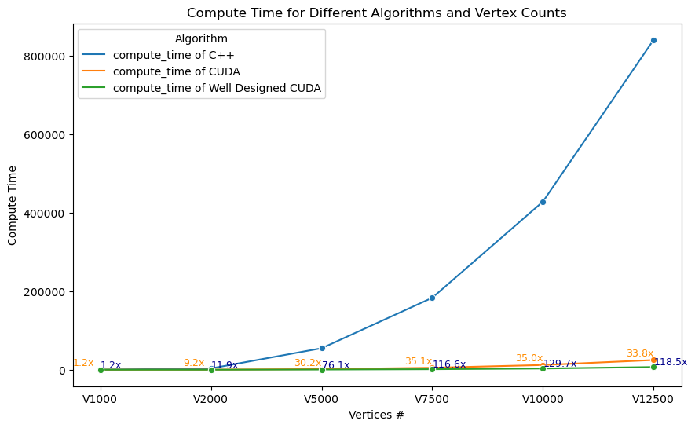
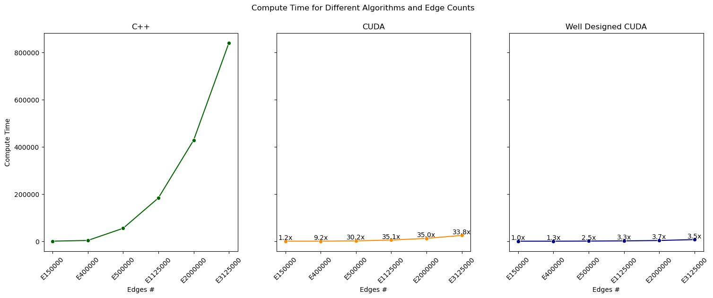

Cuda Based Robust SSP Problem
=============================

## Environment:

1. System: WSL 2 Ubuntu 20.04.5 LTS
2. CPU: Intel(R) Core(TM) i5-12600KF
3. GPU: nVIDIA(R) RTX 3070 8GB RAM
4. RAM: 32GB
5. NVCC: V10.1.243
6. CC:  9.4.0
7. Driver: 531.41
8. CUDA: 12.1

## Data Explanation

#### Data Instance:

```
1000 # First Row: Number of Vertices
150000 # Second Row: Number of Edges
838 618 890 17.290661902827246 
981 611 944 10.019387690812502 
7 340 904 3.526561274367449 
367 323 762 3.3557391727453547 
```

* First Column: Departure Vertex;
* Second Column: Arrival Vertex;

Here, every edges follows a Normal Distribution $\mathcal{N}(\mu,\sigma)$

* Third Column: $\mu$;
* Fourth Column: $\sigma$.

## Performance results:





## Compile source:

* Install make/nvcc
* Update makefile with path to nvcc compiler
* `make all`
